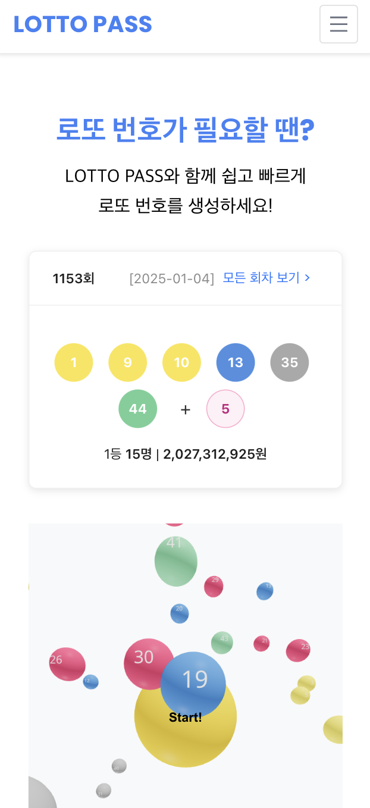
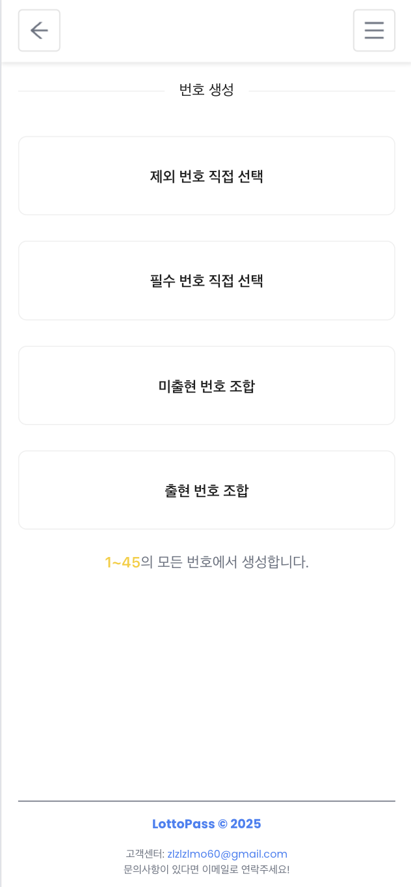

# LottoPass

> **로또 번호 통계와 당첨점 정보를 제공하는 통합 플랫폼**

LottoPass는 로또 당첨 번호의 통계와 데이터를 분석하고, 주변 로또 판매점과 당첨점을 확인할 수 있는 웹 애플리케이션입니다.  
로또를 즐기는 사용자들이 데이터를 기반으로 더 재미있고 편리하게 로또를 경험할 수 있도록 돕습니다.

---

## 📖 프로젝트 개요

- **로또 번호 통계**: 특정 회차 범위에서 번호별 출현 횟수와 패턴을 분석
- **주변 판매점 조회**: 사용자 위치 기반으로 근처 로또 판매점 및 당첨점 정보 확인
- **회차별 상세 보기**: 각 회차의 1등부터 5등까지 당첨자 수 및 총 당첨금 확인
- **최신 정보 크롤링**: 최신 회차의 당첨 정보를 업데이트

---

## 🚀 주요 기능

### 1. 로또 번호 통계

- 번호별 출현 횟수 통계 제공
- 꺾은선 그래프 및 공 형태 시각화를 통해 직관적인 데이터 분석
- 회차 범위를 설정하여 특정 기간의 데이터를 필터링

### 2. 주변 판매점 조회

- **Geolocation API**를 활용해 사용자 위치 기반의 판매점 정보 제공
- 로또 판매점 및 당첨점의 위치와 거리 표시
- **Kakao API**를 통해 위도/경도를 주소로 변환

### 3. 회차별 상세 보기

- 당첨 번호와 보너스 번호 확인
- 각 등수(1등~5등) 당첨자 수와 당첨금액 세부 정보 제공
- 최신 회차의 당첨 매장 정보를 크롤링하여 실시간 업데이트

### 4. 반응형 UI

- 데스크탑과 모바일 환경 모두에 최적화된 사용자 경험 제공

---

## 🛠️ 기술 스택

### 프론트엔드

- **React**: 컴포넌트 기반 UI 라이브러리
- **TypeScript**: 안정성을 보장하는 정적 타입 시스템
- **Ant Design**: UI 구성 및 스타일링
- **Chart.js**: 데이터 시각화를 위한 차트 라이브러리
- **Geolocation API**: 사용자 위치 정보 활용

### 백엔드

- **Nest.js**: 백엔드 애플리케이션 프레임워크
- **TypeORM**: 데이터베이스 ORM
- **MySQL**: 데이터 저장소
- **Axios**: HTTP 요청을 처리하기 위한 클라이언트
- **Kakao API**: 위도/경도를 주소로 변환하기 위한 외부 API

---

## 📦 설치 및 실행 방법

### 1. 클론

```bash
git clone https://github.com/zlzlzlmo/lottopass-frontend.git
cd lottopass-frontend
```

```bash
git clone https://github.com/zlzlzlmo/lottopass-backend.git
cd lottopass-backend
```

### 2. 환경 변수 설정

- `.env` 파일을 프로젝트 루트에 생성하고 아래 내용을 추가합니다:

```plaintext
KAKAO_API_KEY=YOUR_KAKAO_API_KEY
```

### 3. 의존성 설치

```bash
npm install
```

### 4. 개발 서버 실행

```bash
npm run dev(front)
npm run start:dev(backend)
```

### 5. 빌드 (배포용)

```bash
npm run build
```

---

## 📂 프로젝트 구조

### 프론트엔드 구조

```plaintext
src/
├── api/                # API 관련 로직 (axios 인스턴스 및 서비스 클래스)
│   ├── baseAPI.ts      # 공통 API 서비스 클래스
│   ├── DrawService.ts  # Draw API 서비스
│   ├── drawService.ts  # DrawService 인스턴스 생성
│   └── index.ts        # 모든 API 서비스의 엔트리포인트
├── components/         # 재사용 가능한 컴포넌트들
│   ├── Button/
│   │   ├── Button.tsx
│   │   ├── Button.test.tsx
│   │   └── Button.styles.ts
│   ├── Header/
│   │   ├── Header.tsx
│   │   ├── Header.test.tsx
│   │   └── Header.styles.ts
│   └── index.ts        # 컴포넌트 엔트리포인트
├── features/           # 상태 관리 및 페이지별 관련 로직
│   ├── draw/
│   │   ├── hooks.ts
│   │   ├── drawSlice.ts
│   │   ├── types.ts
│   │   ├── utils.ts
│   │   ├── components/ # Draw 관련 컴포넌트
│   │   │   ├── DrawCard.tsx
│   │   │   ├── DrawCard.styles.ts
│   │   │   └── index.ts
│   │   └── index.ts    # Draw 모듈 엔트리포인트
│   └── index.ts        # 모든 feature 엔트리포인트
├── hooks/              # 전역적으로 재사용 가능한 커스텀 훅
│   ├── useInterceptions.ts
│   └── index.ts
├── pages/              # 페이지 컴포넌트
│   ├── HomePage.tsx
├── redux/              # 상태 관리 설정 (Redux)
│   ├── store.ts        # Redux store 설정
├── styles/             # 전역 스타일 관리 (CSS-in-JS, SCSS, Tailwind 등)
│   ├── globals.css     # 전역 스타일
│   └── _variables.ts
├── utils/              # 공통 유틸리티 함수
│   ├── distance.ts
├── App.tsx             # 애플리케이션 루트 컴포넌트
├── index.tsx           # ReactDOM 렌더링 진입점
└── react-app-env.d.ts  # TypeScript 환경 설정
```

### 백엔드 구조

```plaintext
src/
├── utils/              # 공통 유틸리티 함수
├── region/             # 지역 및 판매점 관련 모듈
│   ├── region.controller.ts
│   ├── region.service.ts
│   ├── unique-region.entity.ts
│   ├── winning-region.entity.ts
├── draw/               # 로또 회차 관련 모듈
│   ├── draw.controller.ts
│   ├── draw.service.ts
│   ├── lotto-draw.entity.ts
│   ├── detail-draw.entity.ts
├── crawler/            # 크롤링 모듈
│   ├── crawler.service.ts
│   ├── detail-draw.entity.ts
├── location/            # 위치 모듈
│   ├── location.controller.ts
│   ├── location.service.ts
```

---

## 📊 API 명세

### 1. Region API

| Method | Endpoint                      | Description                    |
| ------ | ----------------------------- | ------------------------------ |
| GET    | `/region/unique/all`          | 모든 지역 목록 가져오기        |
| GET    | `/region/stores/winning`      | 특정 지역의 1등 배출 매장 조회 |
| GET    | `/region/winning/:drawNumber` | 특정 회차의 1등 배출 매장 조회 |
| GET    | `/region/all-stores`          | 특정 지역의 모든 판매점 조회   |

### 2. Draw API

| Method | Endpoint                   | Description                         |
| ------ | -------------------------- | ----------------------------------- |
| GET    | `/draw`                    | 기본 엔드포인트 테스트              |
| GET    | `/draw/latest`             | 최신 회차 정보 가져오기             |
| GET    | `/draw/all`                | 모든 회차 정보 가져오기             |
| GET    | `/draw/:drawNumber`        | 특정 회차 정보 가져오기             |
| GET    | `/draw/detail/:drawNumber` | 특정 회차의 세부 당첨 정보 가져오기 |

### 3. Location API

| Method | Endpoint    | Description                         |
| ------ | ----------- | ----------------------------------- |
| GET    | (내부 호출) | 위도/경도를 주소로 변환 (Kakao API) |

---

## 📊 스크린샷

|  |  |  |
| ----------------------------- | ---------------------------------------- | ---------------------------------------- |
| 홈 화면                       | 로또 통계 화면                           | 판매점 조회 화면                         |

|  |  |
| ---------------------------------------- | ------------------------------------------ |
| 회차별 상세 화면                         | 번호 생성 화면                             |

---

## 📧 문의

- **Email**: zlzlzlmo60@gmail.com
